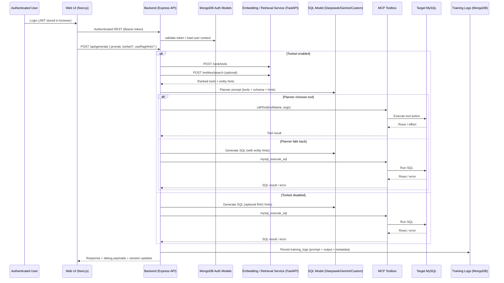

# MCP Agent Demo — Natural Language to SQL Platform

<div align="center">
  <h3>AI-powered MCP workspace with authentication, conversational SQL, and retrieval-aware planning</h3>

<a href="https://nextjs.org/" target="_blank"></a>
<a href="https://www.typescriptlang.org/" target="_blank"></a>
<a href="https://nodejs.org/" target="_blank"></a>
<a href="https://modelcontextprotocol.io/" target="_blank"></a>

</div>

## Overview

MCP Agent Demo turns natural language into SQL while routing work through the Model Context Protocol toolbox. The current release adds organization-aware authentication, persistent chat sessions, saved prompt management, and retrieval-augmented hints that keep planner decisions grounded in indexed entities. The backend continues to log complete training telemetry and orchestrate DeepSeek, Gemini, or custom LLM providers, while the frontend exposes configuration, tooling, and debugging controls in a single workspace.

### Core Capabilities

- **Provider Flexibility** – DeepSeek, Google Gemini, or any custom HTTP-compatible LLM with per-request override from the UI.
- **Tool-First Planner** – Embedding-backed planner ranks MCP tools, applies argument defaults, and only falls back to raw SQL when no tool fits.
- **Retrieval Hints for RAG** – Optional entity retrieval service indexes domain terms (locations, device names, etc.) and feeds filter hints into both the planner and SQL generation pipeline.
- **Authentication & Org Context** – JWT-secured API with admin bootstrap, company/branch hierarchy, and requester metadata captured for every generation.
- **Conversational Workspace** – Chat sessions, history, saved prompts, bulk-insert tooling, and planner debug panels are all available once authenticated.
- **Training Telemetry & Observability** – Every request flows into MongoDB with schema provenance, tool usage, and raw model output; CSV usage reports and planner traces are one click away in debug mode.

## Architecture



Optional components (embedding service, entity retrieval, MongoDB analytics) are auto-detected—if they’re offline, the core SQL flow still works once authentication succeeds.

## Repository Layout

```
├── mcp-backend/                      # Express server, MCP + provider orchestration
│   ├── config.json                   # Persisted runtime configuration
│   ├── reports/                      # Schema/tool snapshots, provider usage CSV
│   ├── scripts/                      # Schema export, tool export, entity indexing helpers
│   │   ├── generate-mysql-schema.js
│   │   ├── export-toolset.js
│   │   ├── create-admin.js
│   │   ├── auto-build-entities.js    # Pull entities via MCP + push to retrieval service
│   │   └── build-and-index-entities.js
│   └── src/
│       ├── controllers/              # Request handlers (auth, config, generate, debug, prompts)
│       ├── middleware/               # JWT auth guards
│       ├── models/                   # Mongoose models (users, sessions, training logs)
│       ├── routes/                   # Express routers (auth, sessions, retrieval, tools)
│       ├── services/                 # LLM providers, MCP bridge, embeddings, retrieval
│       ├── utils/                    # Response helpers, etc.
│       └── db/                       # Mongo connection helper
├── mcp-ui/                           # Next.js 15 App Router frontend
│   ├── src/app/                      # Pages (login, workspace)
│   ├── src/components/home/          # Query/chat/history UI slices
│   └── src/services/api.ts           # REST client (auth, config, sessions, prompts)
├── models/                           # Embedding FastAPI reference implementation
├── tools.yaml                        # MCP toolbox configuration (not committed by default)
├── tools.yaml.example                # Template toolbox configuration
└── README.md
```

## Prerequisites

- **Node.js 18+** and **npm 9+**
- **MCP Toolbox** (CLI) with access to your database tools
- **MySQL** database reachable by the toolbox
- **MongoDB** (required for auth, sessions, prompts, and training logs)
- **Python 3.10+** (only if you plan to run the optional embedding & retrieval FastAPI service)
- **JWT secret** for signing API tokens (`JWT_SECRET`)

## Backend Setup (`mcp-backend/`)

1. **Install dependencies**

   ```bash
   cd mcp-backend
   npm install
   ```

2. **Create `.env`** – copy from `.env.example` and fill in required secrets.

   ```env
   GEMINI_API_KEY=
   DEEPSEEK_API_KEY=
   MCP_TOOLBOX_URL=http://localhost:3333
   CUSTOM_API_BASE=
   EMBED_LLM_URL=http://localhost:8000    # FastAPI embedding + retrieval service
   MYSQL_HOST=localhost
   MYSQL_PORT=3306
   MYSQL_USER=
   MYSQL_PASSWORD=
   MYSQL_DATABASE=
   MONGO_URI=mongodb://localhost:27017/mcp
   MONGO_DB_NAME=mcp
   JWT_SECRET=super-secret-string
   USE_RAG_HINTS=true                    # optional default toggle for entity hints
   ```

3. **Generate schema & tool snapshots**

   ```bash
   npm run schema:mysql          # writes reports/schema.summary.json
   npm run export:toolset        # writes reports/toolset.snapshot.json
   ```

   These files are served to the LLM and pushed to the embedding service; regenerate whenever the DB schema or toolset changes.

4. **Bootstrap authentication**

   ```bash
   npm run create:admin
   ```

   The script prompts for admin credentials and writes the first user to MongoDB. You can also call `POST /auth/admin` directly if you prefer an API-only flow. After the admin exists, use the `/auth/login` endpoint (or UI login page) to obtain a JWT.

5. **(Optional) Seed organizations & users**

   - `POST /auth/companies` to create organizations (admin only)
   - `POST /auth/branches` to attach branches to companies
   - `POST /auth/users` to invite additional analysts tied to those branches
     The `/auth/me` endpoint echoes the authenticated user and organization context; this metadata is logged alongside each generation.

6. **Run the server**
   ```bash
   npm run dev   # or npm start for production mode
   ```
   The API listens on `http://localhost:3001` by default.

### Tool Planner, Retrieval & Snapshots

- Planner requests flow through `reports/schema.summary.json` and `reports/toolset.snapshot.json`. Keep these files fresh to improve embedding accuracy.
- The embedding service endpoint defined by `EMBED_LLM_URL` must expose:
  - `POST /rank/tools`
  - `POST /rank/tables`
  - `POST /embed`
  - `POST /entities/index`
  - `POST /entities/search`
  - `PUT /config/toolset` / `PUT /config/schema`
  - `GET /toolset/info`
- Sync snapshots manually or from the UI via `/api/config/embed-sync`.

### Entity Retrieval & RAG Hints

- `node scripts/auto-build-entities.js --out reports/entities.json` fetches distinct entities via MCP (e.g., locations, device types), writes them to JSON, and pushes them to the embedding service. Add `--schema <path>` to override the default `reports/schema.summary.json` source.
- `node scripts/build-and-index-entities.js reports/entities.json` reads a prepared entity list and indexes it into the retrieval service.
- Once entities are indexed, enabling **RAG Hints** (toggle in the UI header or `useRagHints` in the API request) injects top-matching entities into planner prompts and SQL generation, nudging the model toward the correct filters.

## Frontend Setup (`mcp-ui/`)

1. **Install dependencies**

   ```bash
   cd mcp-ui
   npm install
   ```

2. **Configure API base** – create `.env.local` if you need to customise it.

   ```env
   NEXT_PUBLIC_API_BASE=http://localhost:3001
   ```

3. **Run the app**
   ```bash
   npm run dev
   ```

Visit [http://localhost:3000](http://localhost:3000) and log in with the admin/user credentials you created. The workspace exposes:

- Chat, Query, Tools, Bulk Insert, and History tabs via the left sidebar
- Model selector (DeepSeek, Gemini, Custom) and toggles for Debug + RAG hints
- Session list with rename/delete actions and automatic persistence
- Saved prompt library with export-friendly formatting

## Working with MCP & Toolsets

- Define your MCP tools in `tools.yaml` (copy from `tools.yaml.example`).
- Start the toolbox (`toolbox --ui`) so the backend can list tools and execute them.
- The chat/query panels include a **“Prefer MCP tool execution”** toggle; either state is sent with the `POST /api/generate` request so you can experiment without touching persisted config.
- The Config tab lets you edit system prompts, default provider, and toolset flags. Saving updates `config.json` and triggers an embedding sync when possible.
- Saved sessions capture planner summaries, tool calls, SQL, execution result rows, and debug payloads—perfect for audits or fine-tuning.

## Key API Endpoints

| Method & Path                              | Description                                                                                                                              |
| ------------------------------------------ | ---------------------------------------------------------------------------------------------------------------------------------------- |
| `POST /auth/admin`                         | Bootstrap the first admin user (idempotent once an admin exists).                                                                        |
| `POST /auth/login`                         | Username/password login; returns `{ token, user }`.                                                                                      |
| `GET /auth/me`                             | Returns the authenticated user with company/branch context.                                                                              |
| `POST /auth/companies`                     | Create a company (admin only).                                                                                                           |
| `POST /auth/branches`                      | Create a branch tied to a company (admin only).                                                                                          |
| `POST /auth/users`                         | Invite an additional user (admin only).                                                                                                  |
| `POST /api/generate`                       | Main entry point: accepts `{ prompt, provider?, model?, useToolset?, toolsetName?, useRagHints?, schema? }` and returns SQL/tool output. |
| `GET /api/config` / `PUT /api/config`      | Fetch or persist runtime configuration; PUT triggers embedding syncs when possible.                                                      |
| `POST /api/config/embed-sync`              | Manually push the latest schema/toolset snapshots to the embedding service.                                                              |
| `GET /tools` / `POST /tool`                | List or invoke MCP tools directly via the toolbox.                                                                                       |
| `GET /prompts` / `POST /prompts`           | Saved prompt library CRUD for the authenticated user.                                                                                    |
| `GET /sessions` / `POST /sessions`         | Manage chat sessions; use `POST /sessions/:id/messages` to append conversation turns.                                                    |
| `GET /debug/status` / `POST /debug/toggle` | Inspect or flip verbose debug mode.                                                                                                      |
| `GET /retrieval/search`                    | Proxy to the embedding service for entity search; query via `?query=...&types=device_name,location&limit=5`.                             |

## Observability & Reports

- `mcp-backend/reports/deepseek_usage.csv` – provider token usage appended by `updateUsageCsv`.
- `mcp-backend/reports/schema.summary.json` – latest schema snapshot consumed by the LLM and embedding service.
- `mcp-backend/reports/toolset.snapshot.json` – exported tool metadata used for embeddings.
- `mcp-backend/reports/entities.json` (optional) – entity export generated by the auto-build script.
- MongoDB collections `training_logs`, `sessions`, `saved_prompts`, `users`, `companies`, and `branches` provide end-to-end observability.

Enable debug mode from the UI header or `/debug/toggle` to stream planner traces, token counts, tool arguments, and SQL execution payloads.

## Development Tips

- The backend uses ES modules; npm scripts already pass the correct loader flags.
- When modifying schema or tool definitions, regenerate snapshots and run `/api/config/embed-sync` to keep the embedding service aligned.
- MongoDB connectivity is required for login; watch the console for `MongoDB connected` logs to confirm.
- Entity retrieval is best-effort—if the embedding service is offline, the planner falls back gracefully while logging a warning.

## License

Released under the [MIT License](LICENSE). Contributions and feature ideas are welcome—open an issue or submit a pull request.

## Docker (Backend + MongoDB + MySQL)

1. Build and run services:

   ```bash
   docker compose up -d --build
   ```

2. Environment:

   - The compose file wires sensible defaults. To override secrets (e.g., `DEEPSEEK_API_KEY`, `JWT_SECRET`), export them in your shell before running compose or create a `.env` file in the repo root with those variables.
   - Backend connects to services by name: `mysql` and `mongo`.

3. Access:

   - Backend API: `http://localhost:3001`
   - MySQL: `localhost:3306` (user `mcp` / pass `mcp` / db `mcp`)
   - MongoDB: `localhost:27017`

4. First-time setup inside Docker:

   ```bash
   # Generate schema snapshot and toolset (optional but recommended)
   docker compose exec backend npm run schema:mysql
   docker compose exec backend npm run export:toolset

   # Create initial admin
   docker compose exec backend node ./scripts/create-admin.js
   ```

5. Logs:

   ```bash
   docker compose logs -f backend
   ```

6. Stop & clean up:
   ```bash
   docker compose down
   # remove volumes if you want a clean state
   docker compose down -v
   ```
