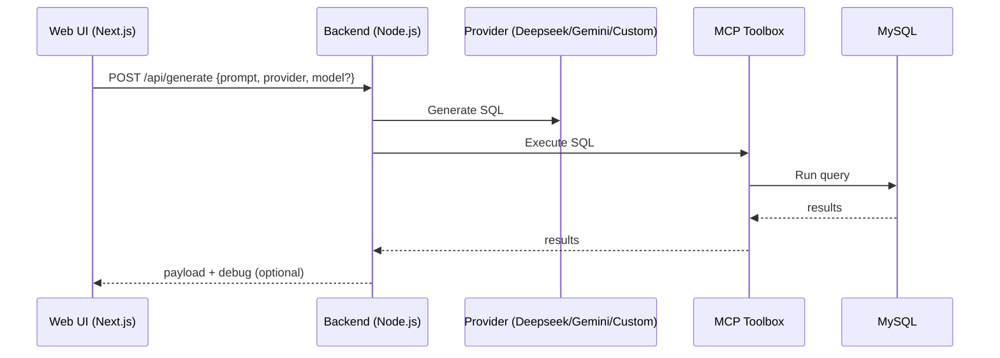

# MCP Agent Demo — Natural Language to SQL Platform

<div align="center">
  <h3>AI-Powered Database Query Interface with MCP Integration</h3>
  
  [](https://nextjs.org/)
  [](https://www.typescriptlang.org/)
  [](https://nodejs.org/)
  [](https://aistudio.google.com/)
  [](https://modelcontextprotocol.io/)
</div>

## Overview

MCP Agent Demo is a natural language to SQL platform with Model Context Protocol (MCP) integration. You can choose an AI provider (Deepseek, Gemini, or a custom GGUF API), generate SQL from natural language, execute via MCP, and view results in a clean UI.

### Key Features

- **Multiple Providers**: Deepseek, Gemini (Google AI Studio), or Custom GGUF HTTP API
- **SQL Generation**: Natural language → SQL using your selected provider
- **MCP Integration**: Execute SQL via MCP toolbox tools
- **Toolset-Aware Routing**: Optionally let the assistant prefer MCP tools before falling back to raw SQL
- **Modern UI**: Next.js + Tailwind, clean and responsive
- **Reports**: Usage and schema summaries under `mcp-backend/reports/`

## Architecture



### Frontend

- **Next.js 15** with App Router
- **TypeScript**, **Tailwind CSS**

### Backend

- **Node.js 18+** with ES modules
- **Providers**: Deepseek, Gemini (Google AI), Custom GGUF API
- **MCP SDK** for tool integration
- **RESTful API** with proper error handling

### Key Components

- **Query Planning Engine**: AI translates natural language to SQL operations
- **MCP Integration**: Dynamic tool discovery and execution
- **Real-time Streaming**: Live progress updates via SSE
- **Result Visualization**: Beautiful display of query results

## Prerequisites

Before you begin, ensure you have the following installed:

- **Node.js** 18.0 or later
- **npm** 9.0 or later
- **MCP Toolbox** running locally

## Quick Start

### 1. Clone the Repository

```bash
git clone https://github.com/afurgapil/mcp-agent-demo.git
cd mcp-agent-demo
```

### 2. Start MCP Toolbox

In the repository root:

```bash
toolbox --ui
```

Access the toolbox UI at: `http://127.0.0.1:5000/ui`

### 3. Configure Backend

Create a `.env` file in `mcp-backend/`:

```env
# Gemini (optional)
GEMINI_API_KEY=your_google_ai_api_key_here
GEMINI_MODEL=gemini-1.5-pro

# Deepseek (optional)
DEEPSEEK_API_KEY=your_deepseek_api_key_here
DEEPSEEK_API_BASE=https://api.deepseek.com
DEEPSEEK_MODEL=deepseek-chat

# Custom GGUF API (optional)
CUSTOM_API_BASE=http://192.168.1.113:8000

# MCP Toolbox
MCP_TOOLBOX_URL=http://127.0.0.1:5000
MCP_SSE_PATH=/sse

# Server
PORT=3001
```

### 4. Install and Start Backend

```bash
cd mcp-backend
npm install
npm run dev
```

Backend server will be available at: `http://localhost:3001`

### 5. Configure and Start Frontend

Create a `.env` file in `mcp-ui/`:

```env
NEXT_PUBLIC_API_BASE=http://localhost:3001
```

Install dependencies and start:

```bash
cd mcp-ui
npm install
npm run dev
```

Open [http://localhost:3000](http://localhost:3000) in your browser.

## Detailed Setup

### Provider Setup

- Gemini: set `GEMINI_API_KEY` (and optional `GEMINI_MODEL`)
- Deepseek: set `DEEPSEEK_API_KEY` (and optional `DEEPSEEK_MODEL`, `DEEPSEEK_API_BASE`)
- Custom GGUF: set `CUSTOM_API_BASE` or update via `PUT /api/config`

### MCP Toolbox Configuration

1. Ensure MCP Toolbox is running on the correct port
2. Configure `MCP_TOOLBOX_URL` in backend `.env`
3. If SSE path differs, adjust `MCP_SSE_PATH` (try `/sse`, `/mcp/sse`, `/mcp`, `/events`)

### Database Configuration

1. Configure your database connection in `tools.yaml`
2. Use `tools.yaml.example` as a template:
   ```bash
   cp tools.yaml.example tools.yaml
   ```
3. Fill in your database connection details
4. Keep `tools.yaml` out of git for security

### Toolset Planner (Optional)

- Set `toolset.enabled` to `true` in `mcp-backend/config.json` (or via `PUT /api/config`) to activate tool-first routing
- When enabled, the backend asks the LLM to inspect the active MCP toolset and choose a tool if it can satisfy the request
- If no suitable tool is found or the tool call fails, the system falls back to the standard SQL generation flow
- The frontend exposes a toggle so you can opt-in per request without changing the persisted configuration

## Features Deep Dive

### SQL Generation

The platform uses the selected provider to:

- **Generate SQL** from natural language
- **Execute** via MCP toolbox (e.g., `mysql_execute_sql`)

### MCP Integration

- **Dynamic Tool Discovery**: Automatically discovers available tools
- **Tool Execution**: Seamlessly executes tools via MCP protocol
- **Error Handling**: Graceful handling of tool execution errors
- **Real-time Updates**: Live progress via Server-Sent Events
- **Toolset Planner (optional)**: Enable `toolset.enabled` to let the assistant pick a matching MCP tool before generating SQL

### Security Features

- **Tool Allowlist**: Control which tools can be executed
- **Input Validation**: Validate all user inputs
- **Error Boundaries**: Graceful error handling and reporting
- **Environment Isolation**: Secure configuration management

## Development

### Project Structure

```
├── mcp-backend/                 # Backend Node.js API
│   ├── index.js                 # Server bootstrap (Express)
│   ├── src/
│   │   ├── app/                 # Express app factory
│   │   │   └── server.js
│   │   ├── controllers/         # Route handlers (health, debug, tools, config, generate)
│   │   ├── routes/              # Route modules (health, debug, tools, config, generate)
│   │   ├── services/            # Core services (mcp, schema, config, deepseek, custom, gemini)
│   │   └── utils/               # Utilities (response helpers, etc.)
│   ├── reports/                 # Reports (schema.summary.json, deepseek_usage.csv)
│   ├── scripts/                 # Helper scripts (e.g., generate-mysql-schema.js)
│   ├── package.json             # Backend dependencies
│   └── .env                     # Backend configuration
├── mcp-ui/                      # Frontend Next.js app
│   ├── src/
│   │   ├── app/                 # Next.js App Router pages
│   │   ├── components/          # UI components (DataTable, DebugJsonCard, ...)
│   │   ├── services/            # API client (backend calls)
│   │   └── utils/               # UI utilities (formatting, extractors)
│   ├── package.json             # Frontend dependencies
│   └── .env.local               # Frontend configuration
├── tools.yaml               # MCP tools configuration
├── tools.yaml.example       # Example tools configuration
└── README.md               # This file
```

### Adding New Tools

1. Define tools in `tools.yaml`
2. Restart MCP Toolbox
3. Tools will be automatically discovered by the backend

### Customizing the UI

1. Modify components in `mcp-ui/src/`
2. Customize styling with Tailwind CSS

## License

This project is licensed under the MIT License - see the [LICENSE](LICENSE) file for details.

## Contributing

1. Fork the repository
2. Create a feature branch
3. Make your changes
4. Add tests if applicable
5. Submit a pull request

## Support

If you encounter any issues or have questions:

1. Check the [Issues](https://github.com/afurgapil/mcp-agent-demo/issues) page
2. Create a new issue with detailed information
3. Join our community discussions
