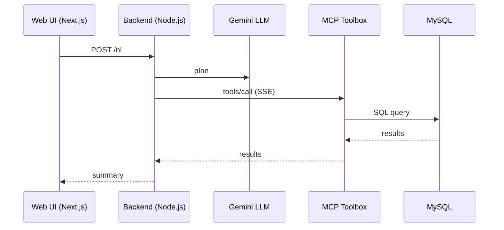

# MCP Agent Demo — Natural Language to SQL Platform

<div align="center">
  <h3>AI-Powered Database Query Interface with MCP Integration</h3>
  
  [](https://nextjs.org/)
  [](https://www.typescriptlang.org/)
  [](https://nodejs.org/)
  [](https://aistudio.google.com/)
  [](https://modelcontextprotocol.io/)
</div>

## Overview

MCP Agent Demo is a cutting-edge natural language to SQL platform that combines AI-powered query planning with Model Context Protocol (MCP) integration. Simply type what you want to do in plain English, and the AI will plan the necessary tools, execute SQL queries, and present the results in a beautiful interface.

### Key Features

- **AI-Powered Planning**: Google Gemini AI translates natural language to SQL operations
- **Real-time Execution**: Instant query planning and execution with live updates
- **MCP Integration**: Seamless integration with Model Context Protocol toolbox
- **Modern UI**: Clean, responsive interface built with Next.js and Tailwind CSS
- **Visual Results**: Beautiful display of query results and execution steps
- **Live Streaming**: Server-Sent Events for real-time progress updates
- **Tool Management**: Dynamic tool discovery and execution via MCP

## Architecture



### Frontend

- **Next.js 15** with App Router
- **TypeScript** for type safety
- **Tailwind CSS** for styling
- **Server-Sent Events** for real-time updates
- **Internationalization** support with next-intl

### Backend

- **Node.js 18+** with ES modules
- **Google Gemini AI** for natural language processing
- **MCP SDK** for tool integration
- **RESTful API** with proper error handling

### Key Components

- **Query Planning Engine**: AI translates natural language to SQL operations
- **MCP Integration**: Dynamic tool discovery and execution
- **Real-time Streaming**: Live progress updates via SSE
- **Result Visualization**: Beautiful display of query results

## Prerequisites

Before you begin, ensure you have the following installed:

- **Node.js** 18.0 or later
- **npm** 9.0 or later
- **MCP Toolbox** running locally

## Quick Start

### 1. Clone the Repository

```bash
git clone https://github.com/afurgapil/mcp-agent-demo.git
cd mcp-agent-demo
```

### 2. Start MCP Toolbox

In the repository root:

```bash
toolbox --ui
```

Access the toolbox UI at: `http://127.0.0.1:5000/ui`

### 3. Configure Backend

Create a `.env` file in `mcp-backend/`:

```env
# Google AI Studio / Gemini API
GEMINI_API_KEY=your_google_ai_api_key_here

# MCP Toolbox Configuration
MCP_TOOLBOX_URL=http://127.0.0.1:5000
MCP_SSE_PATH=/sse

# Server Configuration
PORT=3001
```

### 4. Install and Start Backend

```bash
cd mcp-backend
npm install
npm run dev
```

Backend server will be available at: `http://localhost:3001`

### 5. Configure and Start Frontend

Create a `.env` file in `mcp-ui/`:

```env
NEXT_PUBLIC_API_BASE=http://localhost:3001
```

Install dependencies and start:

```bash
cd mcp-ui
npm install
npm run dev
```

Open [http://localhost:3000](http://localhost:3000) in your browser.

## Detailed Setup

### AI Integration Setup

1. Get API key from [Google AI Studio](https://aistudio.google.com/)
2. Add `GEMINI_API_KEY` to your backend `.env`
3. Restart the backend server

### MCP Toolbox Configuration

1. Ensure MCP Toolbox is running on the correct port
2. Configure `MCP_TOOLBOX_URL` in backend `.env`
3. If SSE path differs, adjust `MCP_SSE_PATH` (try `/sse`, `/mcp/sse`, `/mcp`, `/events`)

### Database Configuration

1. Configure your database connection in `tools.yaml`
2. Use `tools.yaml.example` as a template:
   ```bash
   cp tools.yaml.example tools.yaml
   ```
3. Fill in your database connection details
4. Keep `tools.yaml` out of git for security

## Usage

### Natural Language Queries

Simply type what you want to do in your selected language (English, Turkish, or German):

**Examples:**

**English:**

- "Copy the last row from urls into last_element (create if missing)."
- "Show me all users created in the last week."

**Turkish:**

- "urls tablosundaki son satırı last_element tablosuna kopyala (yoksa oluştur)."
- "Geçen hafta oluşturulan tüm kullanıcıları göster."

**German:**

- "Kopiere die letzte Zeile aus urls in last_element (erstellen falls nicht vorhanden)."
- "Zeige mir alle Benutzer, die in der letzten Woche erstellt wurden."

### Understanding the Results

The interface displays:

1. **Plan**: AI-generated tool selection and arguments
2. **Steps**: Real-time execution of each tool call
3. **Summary**: Final results and execution summary

### Available Endpoints

#### Backend API

- **GET /tools** - List all available MCP tools
- **POST /tool** - Execute a specific tool with arguments
- **POST /nl** - Process natural language query

#### Example API Usage

```bash
# List available tools
curl http://localhost:3001/tools

# Execute a specific tool
curl -X POST http://localhost:3001/tool \
  -H "Content-Type: application/json" \
  -d '{"name": "sql_query", "args": {"query": "SELECT * FROM users"}}'

# Natural language query
curl -X POST http://localhost:3001/nl \
  -H "Content-Type: application/json" \
  -d '{"query": "Show me all users"}'
```

## Features Deep Dive

### AI-Powered Query Planning

The platform uses Google Gemini AI to:

- **Understand Intent**: Parse natural language queries
- **Plan Tools**: Select appropriate MCP tools for the task
- **Generate Arguments**: Create proper tool arguments
- **Provide Rationale**: Explain the reasoning behind tool selection

### MCP Integration

- **Dynamic Tool Discovery**: Automatically discovers available tools
- **Tool Execution**: Seamlessly executes tools via MCP protocol
- **Error Handling**: Graceful handling of tool execution errors
- **Real-time Updates**: Live progress via Server-Sent Events

### Security Features

- **Tool Allowlist**: Control which tools can be executed
- **Input Validation**: Validate all user inputs
- **Error Boundaries**: Graceful error handling and reporting
- **Environment Isolation**: Secure configuration management

## Development

### Project Structure

```
├── mcp-backend/             # Backend Node.js API
│   ├── index.js             # Main server file
│   ├── package.json         # Backend dependencies
│   └── .env                 # Backend configuration
├── mcp-ui/                  # Frontend Next.js app
│   ├── src/
│   │   ├── app/             # Next.js App Router pages
│   │   ├── i18n/            # Internationalization
│   │   └── messages/        # Translation files
│   ├── package.json         # Frontend dependencies
│   └── .env.local           # Frontend configuration
├── tools.yaml               # MCP tools configuration
├── tools.yaml.example       # Example tools configuration
└── README.md               # This file
```

### Adding New Tools

1. Define tools in `tools.yaml`
2. Restart MCP Toolbox
3. Tools will be automatically discovered by the backend

### Customizing the UI

1. Modify components in `mcp-ui/src/`
2. Update translations in `mcp-ui/src/messages/`
3. Customize styling with Tailwind CSS

## License

This project is licensed under the MIT License - see the [LICENSE](LICENSE) file for details.

## Contributing

1. Fork the repository
2. Create a feature branch
3. Make your changes
4. Add tests if applicable
5. Submit a pull request

## Support

If you encounter any issues or have questions:

1. Check the [Issues](https://github.com/afurgapil/mcp-agent-demo/issues) page
2. Create a new issue with detailed information
3. Join our community discussions
